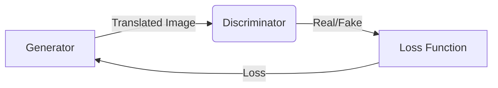

# Introduction to UGATIT
The UGATIT repository is a research-oriented machine learning project focused on unsupervised image-to-image translation. The primary goal of this project is to develop a robust and efficient method for translating images from one domain to another without requiring paired data.

## Project Overview
This document provides an overview of the project, including its purpose, goals, and research motivation. It is intended for new researchers and contributors who want to understand the project's context and objectives.

## High-Level Description
The project consists of several key components:
- `train.py`: The main training script for the UGATIT model.
- `evaluate.py`: The evaluation script for the UGATIT model.
- `README.md`: The project's README file, containing information about the project, its requirements, and usage instructions.
- `tools.py`: A utility script containing various helper functions for the project.
- `train.sh`: A shell script for training the UGATIT model.
- `main.py`: The main entry point for the project.
- `requirements.txt`: The project's requirements file, listing the necessary dependencies.
- `configs/`: A directory containing configuration files for the project.
- `core/`: A directory containing the core implementation of the UGATIT model.

## Prerequisites
None

## Examples
To train the UGATIT model, run the following command:
```bash
python train.py
```
To evaluate the UGATIT model, run the following command:
```bash
python evaluate.py
```

## Architecture
The UGATIT model consists of two main components: the generator and the discriminator. The generator is responsible for translating images from one domain to another, while the discriminator is responsible for distinguishing between real and fake images.

## Module Hierarchies
The project's module hierarchy is as follows:
- `core/`
  - `UGATIT.py`: The main implementation of the UGATIT model.
  - `dataset.py`: A utility script for loading and preprocessing datasets.
  - `loss.py`: A utility script containing various loss functions.
  - `utils.py`: A utility script containing various helper functions.
  - `networks.py`: A utility script containing various neural network implementations.

## Dependencies
The project's dependencies are listed in the `requirements.txt` file.

## Setup and Usage
To set up the project, run the following command:
```bash
pip install -r requirements.txt
```
To use the project, run the following command:
```bash
python main.py
```
