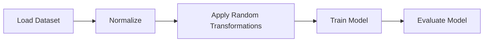

# Project Overview
The UGATIT repository is a research-oriented machine learning project focused on unsupervised image-to-image translation. The primary goal of this project is to develop a robust and efficient method for translating images from one domain to another without requiring paired data.

## High-Level Description
This document explains the data pipeline used in the UGATIT project, including dataset loading, preprocessing, and augmentation.

### Prerequisites
Basic understanding of data preprocessing and computer vision

## Dataset Loading
The dataset loading process is handled by the `dataset.py` file in the `core` directory. This file contains functions for loading and preprocessing the dataset.

### Dataset Structure
The dataset is expected to be in the following structure:
```markdown
dataset/
|-- trainA
|   |-- img1.jpg
|   |-- img2.jpg
|   |-- ...
|-- trainB
|   |-- img1.jpg
|   |-- img2.jpg
|   |-- ...
|-- testA
|   |-- img1.jpg
|   |-- img2.jpg
|   |-- ...
|-- testB
|   |-- img1.jpg
|   |-- img2.jpg
|   |-- ...
```
### Loading Dataset
The `load_dataset` function in `dataset.py` loads the dataset from the specified directory.
```python
from core.dataset import load_dataset

trainA_dataset = load_dataset('dataset/trainA')
trainB_dataset = load_dataset('dataset/trainB')
testA_dataset = load_dataset('dataset/testA')
testB_dataset = load_dataset('dataset/testB')
```

## Data Preprocessing
The data preprocessing step is handled by the `utils.py` file in the `core` directory. This file contains functions for normalizing and transforming the images.

### Normalization
The `normalize` function in `utils.py` normalizes the images to have a mean of 0 and a standard deviation of 1.
```python
from core.utils import normalize

normalized_trainA = normalize(trainA_dataset)
normalized_trainB = normalize(trainB_dataset)
normalized_testA = normalize(testA_dataset)
normalized_testB = normalize(testB_dataset)
```

## Data Augmentation
The data augmentation step is handled by the `utils.py` file in the `core` directory. This file contains functions for applying random transformations to the images.

### Random Transformations
The `apply_random_transformations` function in `utils.py` applies random transformations to the images, such as rotation, flipping, and color jittering.
```python
from core.utils import apply_random_transformations

augmented_trainA = apply_random_transformations(normalized_trainA)
augmented_trainB = apply_random_transformations(normalized_trainB)
augmented_testA = apply_random_transformations(normalized_testA)
augmented_testB = apply_random_transformations(normalized_testB)
```

## Mermaid Diagram
The following mermaid diagram shows the data pipeline:

This diagram shows the flow of data from loading the dataset to training and evaluating the model.

### Setup and Usage
To use the data pipeline, simply call the `load_dataset` function to load the dataset, then call the `normalize` and `apply_random_transformations` functions to preprocess and augment the data.
```python
from core.dataset import load_dataset
from core.utils import normalize, apply_random_transformations

# Load dataset
trainA_dataset = load_dataset('dataset/trainA')
trainB_dataset = load_dataset('dataset/trainB')
testA_dataset = load_dataset('dataset/testA')
testB_dataset = load_dataset('dataset/testB')

# Normalize and augment data
normalized_trainA = normalize(trainA_dataset)
normalized_trainB = normalize(trainB_dataset)
normalized_testA = normalize(testA_dataset)
normalized_testB = normalize(testB_dataset)

augmented_trainA = apply_random_transformations(normalized_trainA)
augmented_trainB = apply_random_transformations(normalized_trainB)
augmented_testA = apply_random_transformations(normalized_testA)
augmented_testB = apply_random_transformations(normalized_testB)
`
